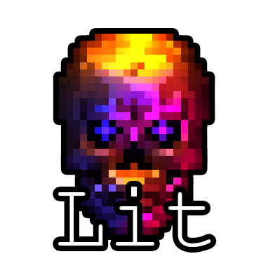

  

<b>Drop-in 2D lighting for Godot 4 — with no light limit.</b>

  
  
  
  
  

---

Lit is an alongside replacement for Godot's built-in 2D lights. It keeps the parts you
like (add a node, set some values, done) and fixes the part you don't: the hard cap of
~15 lights per object. Light a whole scene with as many lights as you want, get real soft
shadows, and stack on a pile of post-processing — all without leaving the node workflow.

  <a href="https://www.youtube.com/watch?v=mWrhQRTlI8w"><em>▶ Watch the tech demo</em></a>

> **Requires Godot 4.4+ on the Forward+ renderer.** (Mobile/Compatibility aren't supported.)

---

## Support

Lit is made and maintained by **Fading Lantern Games**. Questions, bugs, or just want to
show off what you built? Come hang out in our Discord:

**→ https://discord.gg/nfqeRGnM7P**

---

## Installation

**From the Godot Asset Library** *(recommended)*

1. In Godot, open the **AssetLib** tab, search for **Lit**, and download it.
2. Enable it under **Project → Project Settings → Plugins**.

**Manually**

1. Download this repo (Code → Download ZIP, or `git clone`).
2. Copy the **`addons/lit`** folder into your project's `addons/` folder.
3. Enable **Lit** under **Project → Project Settings → Plugins** (reload the project if asked).

---

## Quickstart ([Lit Docs](https://fadinglantern.com/docs/lit))

1. **Enable the plugin.** Project → Project Settings → Plugins → turn on **Lit**. Reload
   the project if Godot asks.
2. **Make it dark.** Add a **`LitCanvasModulate`** node to your scene and set its color to
   something dark. Your world is now in shadow, waiting to be lit. *(Use this instead of
   Godot's `CanvasModulate`, not alongside it.)*
3. **Let your art catch light.** Either drop in a **`LitSprite2D`** (comes ready to go), or
   select existing `Sprite2D` / `TileMapLayer` / other 2D nodes and run
   **Project → Tools → Make Selected Nodes Lit**.
4. **Add a light.** Drop a **`LitPointLight2D`** over your art and watch it light up. Tweak
   color, energy, and range to taste.
5. **Want shadows?** On the light, tick **Shadow Enabled**. Then give the world something to
   block the light: add a `LightOccluder2D` to a sprite, or for tiles enable **SDF
   Collision** on your TileSet's occlusion layer.
6. **Want a look?** Add a **`LitPostProcess`** node and switch on bloom, color grade, CRT,
   or any of the other effects.

That's it — everything updates live in the editor as you build.

---

## What you get

- **Uncapped lights & shadows.** No 15-light limit. Use as many as your scene needs.
- **Three light types.** Point, Directional (a sun), and Spot (a cone).
- **Light textures (cookies).** Drop a texture on a point or spot light to shape it —
  window panes, canopy dapple, blinds — just like the engine's `PointLight2D` texture.
- **Soft or hard shadows.** One slider per light, from razor-sharp to feathery.
- **Normal maps & specular, free.** Reads them straight from your `CanvasTexture` — no wiring.
- **Blinn–Phong or PBR.** Pick the lighting model in Project Settings → Lit. PBR adds
  optional metallic / roughness / AO inputs on the receiver material; switch back to
  Blinn–Phong any time and the extra maps are simply ignored.
- **Darkness & ambient.** One `LitCanvasModulate` node sets the mood for the whole scene.
- **Light masks.** Make a light affect only the things you want it to.
- **Negative lights.** Flip a light to *subtract* to carve pools of extra darkness.
- **Works on any 2D node.** Sprites, tilemaps, polygons — if it draws, it can be lit.
- **Live in the editor.** See your lighting while you build, no need to hit play.
- **20+ post-processing effects** on a single node: bloom, color grade, LUT presets,
  vignette, CRT, VHS, film grain, chromatic aberration, posterize, pixelate, halftone,
  dither, outline, halation, letterbox, lens distortion, light leaks, glitch, and a
  focus/blur-to-sharpen dial.

---

## The nodes

| Node | What it does |
|---|---|
| `LitPointLight2D` | A light that shines in all directions from a point. |
| `LitDirectionalLight2D` | A sun — parallel light across the whole scene. |
| `LitSpotLight2D` | A cone of light you can aim. |
| `LitCanvasModulate` | Sets the scene's darkness/ambient color. |
| `LitSprite2D` | A `Sprite2D` that's already set up to receive light. |
| `LitPostProcess` | The post-processing stack (bloom, grading, CRT, and friends). |

---

## Good to know

- A Lit-lit object is lit **only** by Lit; a normal object is lit only by Godot's built-in
  `Light2D`. The two systems live side by side, so you can convert a project piece by piece.
- For **tilemaps to cast shadows**, the TileSet's occlusion layer needs **SDF Collision**
  turned on (it's off by default).

---

## Contributing

Lit is open source and we'd love the help. Found a bug, have an idea, or want to build out a
feature? Open an issue or pull request right here on GitHub.

Want to talk an idea through first? The [Discord](https://discord.gg/nfqeRGnM7P) is the
quickest way to reach us.

---

## License

Lit is free and open-source under the **MIT License** — use it in anything, commercial or
not, no credit required. See the [`LICENSE`](LICENSE) file for the details.
